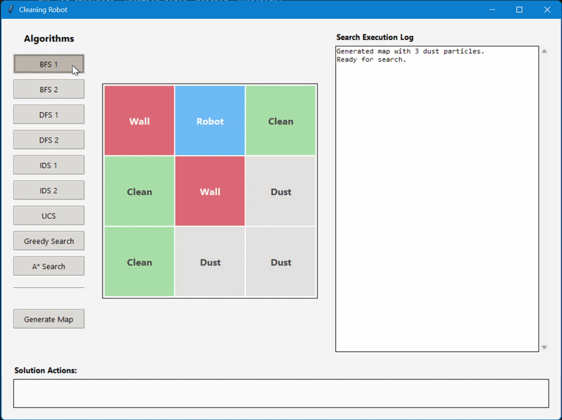
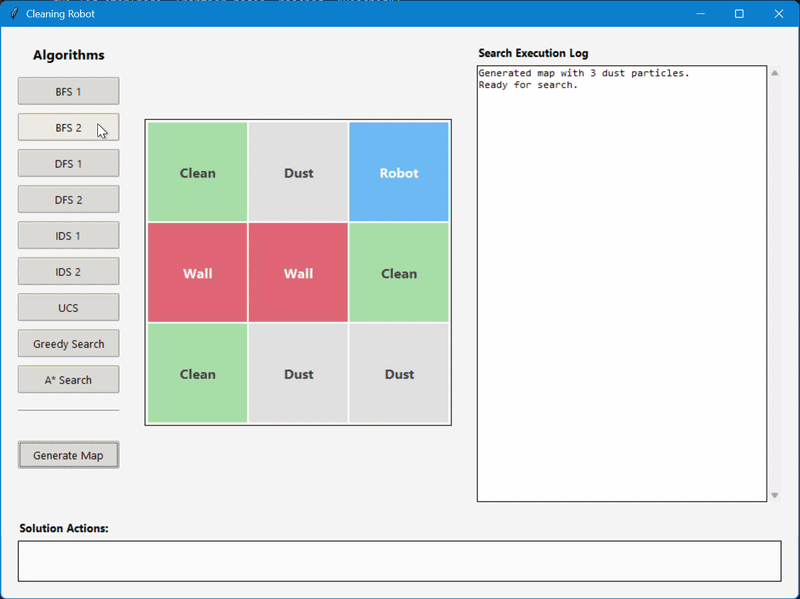
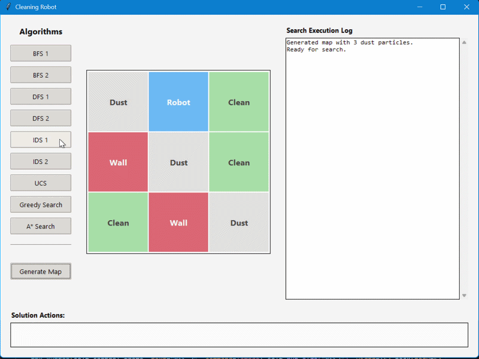
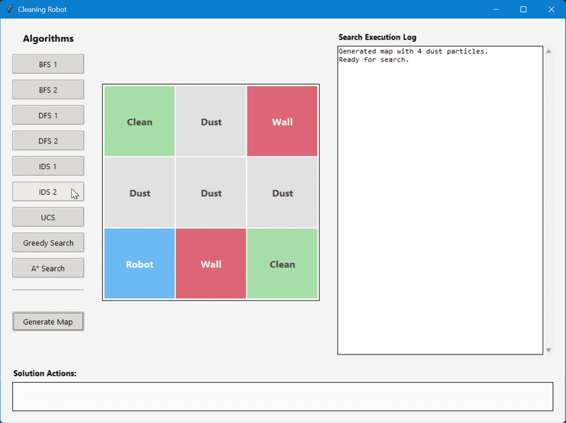
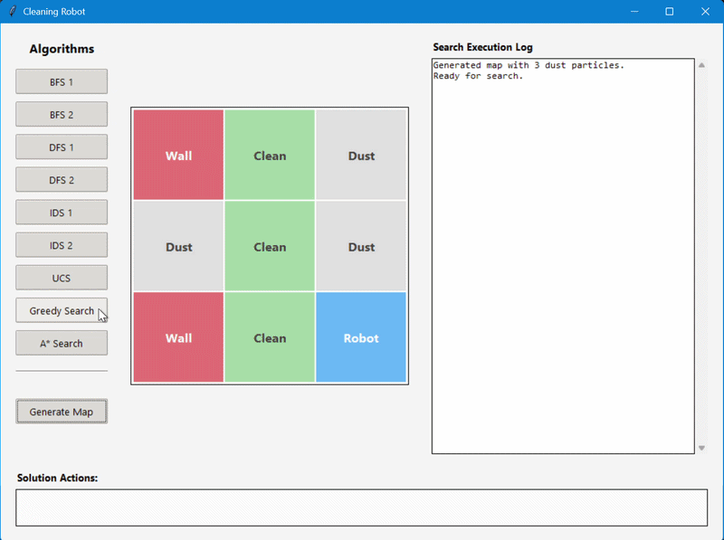
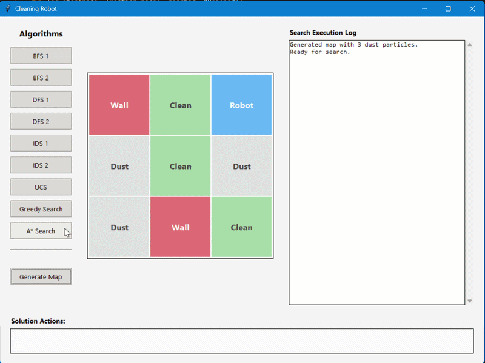

# 🤖 Cleaning Robot — AI Search Algorithms Visualization

Chương trình mô phỏng **robot hút bụi** trên lưới ô vuông, sử dụng giao diện đồ họa (GUI) để trực quan hóa quá trình tìm kiếm của các thuật toán AI cơ bản.

---

## 📋 Mô tả

Robot được đặt trong một lưới **3×3** bao gồm 4 loại ô:

| Giá trị | Ký hiệu | Màu sắc | Ý nghĩa |
|---------|---------|---------|---------|
| `0` | Clean | 🟩 Xanh lá | Ô sạch |
| `1` | Dust | ⬜ Xám | Ô có bụi |
| `2` | Robot | 🟦 Xanh dương | Vị trí robot |
| `3` | Wall | 🟥 Đỏ | Chướng ngại vật |

**Mục tiêu:** Robot cần di chuyển và dọn sạch toàn bộ các ô có bụi (`1`) trên bản đồ.

---

## 🧠 Các thuật toán tìm kiếm

Chương trình triển khai **9 thuật toán tìm kiếm**, chia thành 2 nhóm:

### Tìm kiếm không có thông tin (Uninformed Search)

| Thuật toán | Mô tả |
|-----------|-------|
| **BFS 1** | Tìm kiếm theo chiều rộng — kiểm tra goal khi **mở rộng** node (sau khi pop khỏi Frontier) |
| **BFS 2** | Tìm kiếm theo chiều rộng — kiểm tra goal **sớm** khi sinh node con |
| **DFS 1** | Tìm kiếm theo chiều sâu — kiểm tra goal khi **mở rộng** node |
| **DFS 2** | Tìm kiếm theo chiều sâu — kiểm tra goal **sớm** khi sinh node con |
| **IDS 1** | Tìm kiếm sâu dần — kết hợp DFS 1 với tăng dần giới hạn độ sâu |
| **IDS 2** | Tìm kiếm sâu dần — kết hợp DFS 2 với tăng dần giới hạn độ sâu |
| **UCS** | Tìm kiếm chi phí đồng nhất — ưu tiên node có **path cost g(n)** thấp nhất |

### Tìm kiếm có thông tin (Informed Search)

| Thuật toán | Heuristic h(n) |
|-----------|----------------|
| **Greedy Search** | h(n) = số lượng bụi còn lại |
| **A\* Search** | f(n) = g(n) + h(n), với h(n) = khoảng cách Manhattan đến bụi gần nhất + (số bụi − 1) |

> **Cách tiếp cận 1 và 2:** Cách tiếp cận 1 kiểm tra goal sau khi pop node ra khỏi frontier. Cách tiếp cận 2 kiểm tra goal sớm ngay khi tạo node con — giúp tìm thấy nghiệm nhanh hơn với BFS (đảm bảo tối ưu), nhưng DFS cách tiếp cận 2 có thể trả về nghiệm không tối ưu.

---

## 🎬 Demo

### Generate Map — Tạo bản đồ ngẫu nhiên


### BFS 1 — Breadth-First Search (Cách tiếp cận 1)


### BFS 2 — Breadth-First Search (Cách tiếp cận 2)


### DFS 1 — Depth-First Search (Cách tiếp cận 1)


### DFS 2 — Depth-First Search (Cách tiếp cận 2)


### IDS 1 — Iterative Deepening Search (Cách tiếp cận 1)


### IDS 2 — Iterative Deepening Search (Cách tiếp cận 2)


### UCS — Uniform Cost Search


### Greedy Search


### A\* Search


---

## 🖥️ Giao diện

Giao diện được chia thành 3 khu vực:

- **Cột trái — Controls:** Các nút chọn thuật toán và nút `Generate Map` để tạo bản đồ ngẫu nhiên mới.
- **Cột giữa — Grid Canvas:** Hiển thị trạng thái bản đồ theo thời gian thực, robot di chuyển được animation trực tiếp.
- **Cột phải — Search Execution Log:** Ghi lại từng bước tìm kiếm theo định dạng:
  ```
  Node     : <tên node>
  Frontier : [{state, parent, action, cost} NodeName, ...]
  Explored : [A.State, B.State, ...]
  ----------------------------------------
  ```
- **Phía dưới — Solution Actions:** Hiển thị chuỗi hành động tìm được và tổng số bước.

---

## 🚀 Cài đặt và chạy

### Yêu cầu

- Python **3.x**
- Thư viện `tkinter` (có sẵn trong bộ cài Python tiêu chuẩn)

### Cài đặt

```bash
# Clone repository
git clone <repo-url>
cd <repo-folder>
```

### Chạy chương trình

**Cách 1 — Chạy từ Jupyter Notebook:**
```bash
jupyter notebook Cleaning_Robot_Visualization.ipynb
```
Sau đó chạy toàn bộ các cell trong notebook.

**Cách 2 — Xuất và chạy file `.py`:**
```bash
# Xuất notebook thành file Python
jupyter nbconvert --to script Cleaning_Robot_Visualization.ipynb

# Chạy file Python
python Cleaning_Robot_Visualization.py
```

---

## 🗂️ Cấu trúc project

```
📦 cleaning-robot/
├── 📓 Cleaning_Robot_Visualization.ipynb   # Notebook chính
├── 📁 images/
│   ├── Generate Map.gif
│   ├── BFS1.gif
│   ├── BFS2.gif
│   ├── DFS1.gif
│   ├── DFS2.gif
│   ├── IDS1.gif
│   ├── IDS2.gif
│   ├── UCS.gif
│   ├── GS.gif
│   └── Asao.gif
└── 📄 README.md
```

---

## ⚙️ Chi tiết kỹ thuật

### Biểu diễn trạng thái (State Representation)
Trạng thái là một **ma trận 2D** (list of lists) với các giá trị `0, 1, 2, 3`.

### Hàm chi phí

| Thuật toán | g(n) | h(n) |
|-----------|------|------|
| BFS / DFS / IDS | Độ sâu node | — |
| UCS | Tổng số ô bụi tích lũy dọc đường đi | — |
| Greedy | — | Số bụi hiện tại |
| A\* | Tổng số ô bụi tích lũy | Manhattan đến bụi gần nhất + (số bụi − 1) |

### Tạo bản đồ ngẫu nhiên
Mỗi lần nhấn `Generate Map`:
- **2 chướng ngại vật** được đặt ngẫu nhiên
- **1–6 hạt bụi** được đặt ngẫu nhiên vào các ô còn trống
- **Robot** được đặt ngẫu nhiên tại 1 ô

---

## 📚 Tham khảo

- Russell, S., & Norvig, P. — *Artificial Intelligence: A Modern Approach* (4th Edition), Chapter 3: Solving Problems by Searching